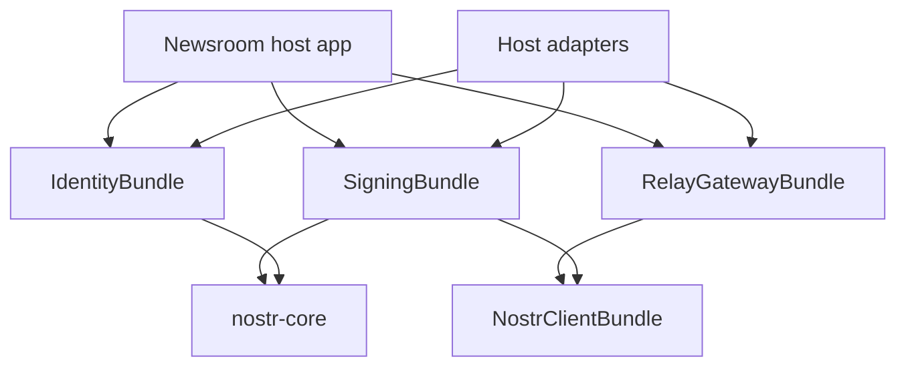

# Signing Bundle Extraction Recommendation

## Recommendation

Extract Nostr signing into a dedicated `decent-newsroom/signing-bundle` package before doing any separate Git repository move. The target should be a package boundary where IdentityBundle authenticates and links people, RelayGatewayBundle maintains relay connections, and SigningBundle owns every reusable way to obtain a Nostr signature.

The important rule is:

> Authentication consumes signatures. Relay transport consumes signatures. Neither should own signing sessions or signer transports.

This keeps NIP-46, NIP-07 fallback plumbing, NIP-42 relay AUTH signing, NIP-98 signing permissions, and future signer types from becoming hidden responsibilities of IdentityBundle or RelayGatewayBundle.

## Target Signing Flows

The bundle boundary should support these flows at the same time:

1. **Extension publishing.** A user signs in with a browser extension. When they publish events, browser JavaScript signs the event and posts the already signed event to the backend. The backend verifies the event id, signature, pubkey, and logged-in user relationship, then persists and relays it. SigningBundle does not need to sign in this path.
2. **Extension relay AUTH.** A user signs in with a browser extension and one of their relays requires NIP-42 AUTH. RelayGatewayBundle receives the challenge and asks the host `AuthChallengeSignerInterface` for a signed kind `22242` event. The host adapter can create a pending request, forward it to the browser through Mercure, let JavaScript sign through the extension, validate the posted response against the pending relay/challenge/pubkey, and return it to the gateway so the gateway can send `AUTH` and maintain the authenticated connection.
3. **Bunker publishing and relay AUTH.** A user signs in with a bunker/remote signer. Browser-side NIP-46 WebSockets may still be needed for the initial pairing/login flow, but after `/api/nostr-connect/session` stores the encrypted server session, SigningBundle should know how to reach the user's bunker directly. The host may submit unsigned event intent to SigningBundle, receive a signed event, verify it, then persist and relay it. Relay AUTH should also use SigningBundle first when a valid server-side bunker session exists.

The common post-signing pipeline should be shared:

```text
unsigned intent or signed event -> signer selection -> signed event -> verification -> policy checks -> persistence -> relay publish
```

The important split is that SigningBundle obtains signatures. It does not authenticate accounts, decide publication policy, write article/event rows, or own relay connection lifecycles.

## Coexistence Rules

Extension and bunker signing can coexist for the same app and even the same account if the signing source is explicit per operation:

- Browser-initiated extension sessions keep using browser-side signing for publish actions and NIP-98 requests.
- Server-side and background operations may use a stored NIP-46 bunker session when one exists and the requested event is permitted.
- RelayGatewayBundle should ask for a signed kind `22242` event through one gateway contract. The host adapter may try SigningBundle NIP-46 first, then optionally fall back to Mercure/browser signing.
- Do not silently switch signing methods without recording the method. Activity logs should distinguish `nip07`, `nip46`, `fallback`, and `none` where relevant.
- The backend must verify every signed event it receives or obtains, regardless of whether it came from an extension, a bunker, or a fallback path.
- Browser/Mercure fallback should never refresh the server-side NIP-46 session. Only a successful bunker response should extend that encrypted session.

## Current Shape

Today the responsibilities are close, but still tangled:

| Area | Current owner | Concern |
|---|---|---|
| Nostr Connect QR permissions | `IdentityBundle\Controller\NostrConnectController` and legacy app controller | Signing permission policy lives with identity/auth controller code. |
| NIP-46 encrypted server session | `IdentityBundle\Service\Nostr\Nip46SessionStore` | Remote signer session lifecycle is a signing concern, not an identity-link concern. |
| Legacy host NIP-46 session store | `App\Service\Nostr\Nip46SessionService` | Same Redis prefix and storage shape as the bundle store; remove or alias it during extraction so two active stores cannot survive. |
| Server-side NIP-42 signing strategy | `IdentityBundle\Service\Nostr\RemoteBunkerSignerStrategy` | Good abstraction, but currently names IdentityBundle as owner. |
| NIP-46 relay RPC transport | `App\Service\Nostr\Nip46AuthSigner` | Host-owned transport should move into a reusable signing implementation backed by `nostr-client-bundle`. |
| Relay AUTH challenge request | `RelayGatewayBundle\Contract\AuthChallengeSignerInterface` | Good gateway boundary. It should stay protocol-specific and not learn about IdentityBundle or NIP-46 internals. |
| Browser/Mercure fallback | `App\RelayGateway\IdentityAuthChallengeSigner` | Host-specific fallback path; keep optional and outside the gateway bundle. |

The new `sign_event:22242` permission and server-session TTL refresh are the right short-term fixes, but they make the next boundary visible: permissions and session extension belong with signing, not identity.

## Target Dependency Direction



Rules:

- `SigningBundle` must not depend on `IdentityBundle`.
- `SigningBundle` must not depend on `RelayGatewayBundle`.
- `RelayGatewayBundle` must not depend on `IdentityBundle` or signing implementation classes.
- `IdentityBundle` may depend on signing contracts only if it needs to initiate signer pairing, but it should not own NIP-46 session storage or signer strategy implementations.
- The host app wires the three bundles together through adapters.

## What SigningBundle Should Own

Move or recreate these concepts under `DecentNewsroom\SigningBundle`:

| Current code | Target owner | Notes |
|---|---|---|
| `NostrSignerStrategyInterface` | SigningBundle contract | Rename away from IdentityBundle. Keep method-based discovery if useful. |
| `NostrSignerStrategyRegistry` | SigningBundle service | Tag should become `signing.nostr_signer_strategy`. |
| `Nip46SessionStore` | SigningBundle service or storage adapter | Prefer a `RemoteSignerSessionStoreInterface` plus Redis implementation. Keep encrypted-at-rest and TTL refresh behavior. |
| `RemoteBunkerSignerStrategy` | SigningBundle service | It should sign arbitrary allowed Nostr events, not just relay AUTH. |
| `Nip46AuthEventSignerInterface` | SigningBundle contract or internal service | The implementation should move from `App\Service\Nostr\Nip46AuthSigner` into the bundle and use `nostr-client-bundle` for relay IO. |
| Nostr Connect permission list | SigningBundle config | Use config such as `signing.nostr_connect.requested_permissions`, not hard-coded IdentityBundle constants. |
| Nostr Connect QR/session endpoints | SigningBundle optional controller layer | QR generation is pre-auth and subjectless. Server-session registration is post-auth and can depend on a host-provided current-subject/pubkey resolver. IdentityBundle should not own the session store. |
| Session extension/revival | SigningBundle | Refresh TTL after successful bunker responses. Add retry/revival policy around stale relay connections, not browser Mercure. |

Recommended core contracts:

```php
interface NostrEventSignerInterface
{
    /** @param array<string,mixed> $unsignedEvent */
    public function sign(string $subjectPubkeyHex, array $unsignedEvent, int $timeoutSeconds = 15): ?array;
}

interface RelayAuthSignerInterface
{
    public function supportsRelayAuth(string $pubkeyHex): bool;
    public function signRelayAuth(string $pubkeyHex, string $relayUrl, string $challenge, int $timeoutSeconds = 15): ?array;
}

interface NostrSignerStrategyInterface
{
    public function getMethod(): string;
    public function supports(string $subjectPubkeyHex): bool;

    /** @param array<string,mixed> $unsignedEvent */
    public function sign(string $subjectPubkeyHex, array $unsignedEvent, int $timeoutSeconds = 15): ?array;
}

interface RemoteSignerSessionStoreInterface
{
    public function has(string $subjectPubkeyHex): bool;
    public function get(string $subjectPubkeyHex): ?RemoteSignerSession;
    public function store(string $subjectPubkeyHex, RemoteSignerSession $session): void;
    public function refresh(string $subjectPubkeyHex, int $ttlSeconds): bool;
    public function remove(string $subjectPubkeyHex): void;
}
```

The bundle can still expose array-based methods at first to reduce churn, but the internal target should be typed value objects or `innis/nostr-core` event objects where practical.

## What IdentityBundle Should Keep

IdentityBundle should keep:

- user identity links and identity-provider registry;
- Nostr login/authentication verification;
- `npub`/hex normalization where it relates to account identity;
- Symfony user bridge contracts;
- NIP-98 authentication logic, if the endpoint is about proving identity to the app.

IdentityBundle should not keep:

- NIP-46 encrypted remote-signer session storage;
- bunker relay RPC transport;
- signer strategy registry;
- NIP-42 relay AUTH signing;
- Nostr Connect signing permission policy beyond consuming configurable SigningBundle output.

If IdentityBundle needs to offer a login UI that includes Nostr Connect, it should call a SigningBundle service such as `NostrConnectUriFactory`. The QR generation path must not require an authenticated subject because it is used before login; the session-registration path must require a resolved authenticated subject pubkey before storing bunker credentials.

## What RelayGatewayBundle Should Keep

RelayGatewayBundle should keep:

- persistent relay WebSocket connection pooling;
- sequential single-filter subscription behavior;
- user-keyed versus shared connection handling;
- NIP-42 challenge detection;
- `AuthChallengeSignerInterface` or an equivalent relay-auth contract;
- health/activity/filter-stat extension points.

RelayGatewayBundle should not keep:

- NIP-46 session knowledge;
- IdentityBundle class references;
- Mercure/browser fallback code;
- signer relay selection;
- permission decisions.

The gateway should ask for one thing: a signed kind `22242` AUTH event for a pubkey, relay URL, and challenge. How that signature is obtained belongs elsewhere.

## Browser/Mercure Fallback

Keep the Mercure browser fallback as a host-level compatibility strategy, not as gateway or signing core.

Recommended behavior:

1. Try server-side SigningBundle NIP-46 signing first.
2. If no valid server session exists, return `null` quickly.
3. Optionally allow the host app to fall back to Mercure/browser signing behind an explicit config flag.
4. Do not refresh the server session after browser fallback. Refresh only after a successful bunker response.
5. Record the fallback separately in activity logs so it is visible when server-side signing is not working.

This matches the product direction: server-side bunker comms should go directly to the signer relays and should not depend on the user's browser being open, subscribed, or reachable through Mercure.

## Session Extension And Revival

SigningBundle should own session lifecycle policy:

- Refresh the encrypted server-session TTL after every successful bunker response.
- Use one TTL for the encrypted server session and expose it through config.
- Store enough metadata for diagnostics: stored time, last success time, last failure time, relay count, signer method.
- Do not extend sessions after timeouts, invalid signatures, missing permissions, or browser fallback.
- When a session exists but a request times out, retry across the stored bunker relays with fresh subscriptions before publishing the NIP-46 request event.
- Treat session revival as reconnecting/retrying NIP-46 relay communication, not as silently minting a new identity or new signer authorization.
- If the encrypted server session is gone, the server cannot revive it; the user must pair/sign in again.

This distinction matters: extending a live server session is safe after a successful bunker response. Reviving a missing session is impossible without the browser or another stored credential.

## SigningBundle Plan

Create `packages/signing-bundle` as a Composer package named `decent-newsroom/signing-bundle` with namespace `DecentNewsroom\SigningBundle`.

Suggested package layout:

```text
packages/signing-bundle/
  composer.json
  src/
    Contract/
      NostrEventSignerInterface.php
      NostrSignerStrategyInterface.php
      RelayAuthSignerInterface.php
      RemoteSignerSessionStoreInterface.php
      CurrentSubjectPubkeyResolverInterface.php
      SignerRelayProviderInterface.php
    Controller/
      NostrConnectController.php
      RemoteSignerSessionController.php
    DependencyInjection/
      Configuration.php
      SigningExtension.php
    Service/
      NostrConnectUriFactory.php
      NostrSignerStrategyRegistry.php
      RelayAuthEventFactory.php
      RemoteBunkerSignerStrategy.php
      Nip46ResponseHandler.php
      Nip46SessionStore.php
      Nip46EventSigner.php
    Storage/
      RedisRemoteSignerSessionStore.php
    ValueObject/
      RemoteSignerSession.php
    Resources/config/
      routes.yaml
      services.php
  tests/
```

Core service responsibilities:

- `NostrConnectUriFactory` builds subjectless pre-auth Nostr Connect URIs and QR payloads from configured app metadata, signer relays, and requested permissions.
- `RemoteSignerSessionController` receives post-auth NIP-46 session credentials, resolves the current subject through a host adapter, validates relay/pubkey/key shapes, and stores an encrypted `RemoteSignerSession`.
- `Nip46SessionStore` is the compatibility lifecycle service for `store`, `get`, `refresh`, and `remove`; `RemoteSignerSessionStoreInterface` and `RedisRemoteSignerSessionStore` hold the typed session storage boundary.
- `NostrSignerStrategyRegistry` resolves explicit signing methods such as `nip46`, while allowing future signers to be tagged with `signing.nostr_signer_strategy`.
- `Nip46EventSigner` performs NIP-46 `sign_event` RPC through `nostr-client-bundle`, validates the bunker response, and returns the signed event without persisting or publishing it.
- `RemoteBunkerSignerStrategy` adapts stored NIP-46 sessions to `NostrEventSignerInterface`.
- `RelayAuthSignerInterface` builds and signs kind `22242` relay AUTH events by delegating to the event signer.

Host-owned adapters should remain outside the bundle:

- current Symfony user to Nostr pubkey resolution;
- app policy for whether an unsigned event intent may be signed;
- signed event verification/persistence/relay publishing pipeline;
- Mercure browser fallback for extension relay AUTH;
- gateway activity/health logging adapters;
- logout listener wiring, except for calling the SigningBundle session manager;
- publication UI and JavaScript for extension-side signing.

Initial configuration shape:

```yaml
signing:
  app_name: 'Decent Newsroom'
  app_url: null
  nostr_connect:
    requested_permissions:
      - 'sign_event:27235'
      - 'sign_event:22242'
      - 'get_public_key'
  nip46:
    session_ttl_seconds: 28800
    request_timeout_seconds: 15
    redis_prefix: 'nip46_session:'
    signer_relays: []
  relay_auth:
    browser_fallback_enabled: false
```

The bundle should expose enough diagnostics for the host to explain which method signed or failed, but not require the host to install RelayGatewayBundle or IdentityBundle.

## Implementation Snapshot

The first in-repo implementation now lives at `packages/signing-bundle` and is consumed by the host through Composer as `decent-newsroom/signing-bundle`.

Implemented pieces:

- `SigningBundle\Contract` owns the signer, relay AUTH, NIP-46 event signer, current-subject resolver, signer relay provider, and remote session store contracts.
- `NostrConnectController` owns the stable pre-auth `/nostr-connect/qr` route.
- `RemoteSignerSessionController` owns the stable post-auth `/api/nostr-connect/session` route and stores encrypted sessions under the authenticated subject pubkey supplied by the host.
- `RedisRemoteSignerSessionStore` preserves the existing `nip46_session:` Redis prefix and AES-GCM encrypted client private key storage while recording remote-signer pubkey, relays, subject pubkey, secret, and diagnostics timestamps.
- `Nip46EventSigner` performs `sign_event` RPC through `nostr-client-bundle`, keeps NIP-04 compatibility for the current bunker path, and verifies returned signed events before handing them back.
- `RemoteBunkerSignerStrategy` signs arbitrary unsigned Nostr event intent and relay AUTH events through the same stored NIP-46 session.
- The host app now provides `App\Signing\AppCurrentSubjectPubkeyResolver`, keeps Mercure/browser relay AUTH fallback in `App\RelayGateway\IdentityAuthChallengeSigner`, and records gateway health/activity outside the bundle.

The TypeScript [`johninnis/nostr-nip46-ts`](https://github.com/johninnis/nostr-nip46-ts) package is useful design confirmation, but not a PHP dependency. It reinforces three constraints mirrored here: keep remote-signer pubkey separate from user pubkey, verify signed-event pubkey/signature after `sign_event`, and keep relay transport injectable instead of hard-wiring it to content publishing.

## Proposed Migration Sequence

1. Inventory the existing signing surface: IdentityBundle signing contracts/services/controllers, `App\Service\Nostr\Nip46AuthSigner`, `App\Service\Nostr\Nip46SessionService`, `/nostr-connect/qr`, `/api/nostr-connect/session`, logout cleanup, Mercure relay AUTH fallback, frontend callers, config aliases, tests, and docs.
2. Create `packages/signing-bundle` with its own `composer.json`, namespace, config loader, route/service resources, and tests.
3. Add a root Composer path repository for `packages/signing-bundle`, require `decent-newsroom/signing-bundle: @dev`, register `DecentNewsroom\SigningBundle\SigningBundle` in `config/bundles.php`, and prove the host consumes it through Composer rather than an app autoload path.
4. Copy/move signing contracts into `SigningBundle\Contract`; leave deprecated IdentityBundle interfaces extending the new contracts for one release.
5. Move `NostrSignerStrategyRegistry`, `Nip46SessionStore`, and `RemoteBunkerSignerStrategy` into SigningBundle. Either delete `App\Service\Nostr\Nip46SessionService` or make it a deprecated alias/facade to the same SigningBundle store.
6. Move `App\Service\Nostr\Nip46AuthSigner` into SigningBundle as `Nip46EventSigner` and replace its relay IO with `nostr-client-bundle` instead of host-specific relay code.
7. Add SigningBundle config for signer relays, requested Nostr Connect permissions, session TTL, timeout, retry behavior, Redis key prefix, and optional browser fallback enablement.
8. Split route ownership clearly: `/nostr-connect/qr` remains stable but is subjectless/pre-auth; `/api/nostr-connect/session` remains stable but requires a host-provided authenticated subject pubkey before storing the server session.
9. Replace `App\RelayGateway\IdentityAuthChallengeSigner` with a host adapter that depends on SigningBundle's `RelayAuthSignerInterface` and GatewayBundle's `AuthChallengeSignerInterface`. Keep Mercure/browser signing as an optional host fallback, not gateway or signing core.
10. Update publishing paths so bunker sessions may submit unsigned event intent to SigningBundle, while extension sessions continue posting already signed events. Both paths must converge on the same signed-event verification/persistence/relay-publish pipeline.
11. Update logout cleanup to depend on a SigningBundle session manager contract, not `IdentityBundle\Service\Nostr\Nip46SessionStore`.
12. Remove direct IdentityBundle signer service aliases from `config/services.yaml` after consumers have moved.
13. Run host tests and package tests while the package still lives in `packages/`; only then extract to a separate repository.

## Compatibility Plan

For one transition release, keep aliases like these:

- `DecentNewsroom\IdentityBundle\Contract\NostrSignerStrategyInterface` extends `DecentNewsroom\SigningBundle\Contract\NostrSignerStrategyInterface`.
- `DecentNewsroom\IdentityBundle\Service\Nostr\Nip46SessionStore` becomes a deprecated alias to the SigningBundle service if Symfony aliasing allows it cleanly.
- `App\Service\Nostr\Nip46SessionService` is removed or becomes a deprecated alias/facade to the same SigningBundle session manager.
- The existing `/nostr-connect/qr` route remains stable even if the controller class moves.
- The existing `/api/nostr-connect/session` payload remains stable.

Deprecation should be shallow and temporary. Avoid carrying two active session stores.

## Acceptance Criteria

The extraction is healthy when all of these are true:

- `rg "IdentityBundle" packages/relay-gateway-bundle src/RelayGateway` finds no gateway dependency on IdentityBundle classes, except intentional host adapters during the transition.
- `rg "RelayGatewayBundle" packages/signing-bundle packages/identity-bundle` finds no signing or identity dependency on the gateway package.
- The root app requires `decent-newsroom/signing-bundle` through a Composer path repository and registers `SigningBundle` in `config/bundles.php`.
- SigningBundle can run its own unit tests without the host app kernel.
- GatewayBundle tests can fake `AuthChallengeSignerInterface` without installing IdentityBundle.
- IdentityBundle tests can authenticate a user without installing RelayGatewayBundle.
- `/nostr-connect/qr` works before login and does not require a current subject.
- `/api/nostr-connect/session` refuses unauthenticated storage and stores the session under the authenticated subject pubkey.
- Extension publishing still posts already signed events and does not require SigningBundle to sign.
- Bunker publishing can submit unsigned event intent, receive a server-side NIP-46 signature, then use the shared verification/persistence/relay-publish pipeline.
- A server-side NIP-42 AUTH challenge signs through NIP-46 without Mercure when a stored session exists.
- Browser fallback is optional, observable, and disabled by default in gateway-auth paths if the product goal is minimal public/browser roundtrips.
- Nostr Connect requested permissions are configurable and include `sign_event:22242` for relay AUTH deployments.

## Final Shape

The clean end state is:

- IdentityBundle answers: "Who is this user, and how is this account linked?"
- SigningBundle answers: "Can we obtain a valid Nostr signature for this pubkey, and by which method?"
- RelayGatewayBundle answers: "How do we keep relay connections alive and authenticated?"
- The host app answers: "Which bundles are enabled, which relays are trusted, and what fallback policy do we want?"


